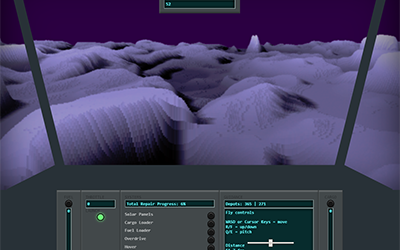

# Star-Crasher
A quasi-3d starship piloting game for js13k 2018

## Version 1.0 Submission for js13k 2018

Original made for js13k competition 2018 over the course of several days

### Play Now

* [v1.0 (13k) on deathraygames.com](https://deathraygames.com/play-online/star-crasher/js13k/)

Screenshot:

## JS13k

* [JS13k Rules](http://2018.js13kgames.com/#rules): Make a game with a package size less than 13k (13,312 bytes)
* See all the entries for the competition at http://2018.js13kgames.com/

## Size

* Source: 31.7 KB (32,519 bytes)
  - scripts 25.7 KB
  - styles 3.18 KB
  - index.html 2.79 KB
* _didn't minify_
* Zipped: 10.3 KB (10,648 bytes)

## Credits

 * Developed by Luke Nickerson
 * Incorporates some great algorithms by others:
   * Sebastian Macke's brilliant [Voxel Space algorithms](https://github.com/s-macke/VoxelSpace) ([ES6 version](https://github.com/Lukenickerson/VoxelSpace))
   * Hunter Loftis's [terrain-generation algorithm](https://github.com/hunterloftis/playfuljs-demos/blob/gh-pages/terrain/index.html)
 * Inspired by [Orion (LD31) by feiss](http://ludumdare.com/compo/ludum-dare-31/?action=preview&uid=8733)

